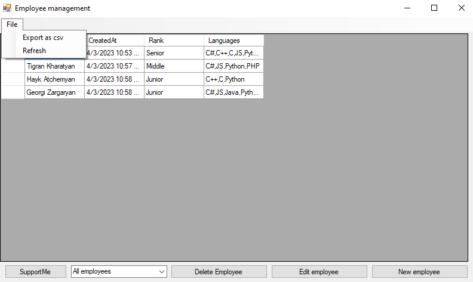
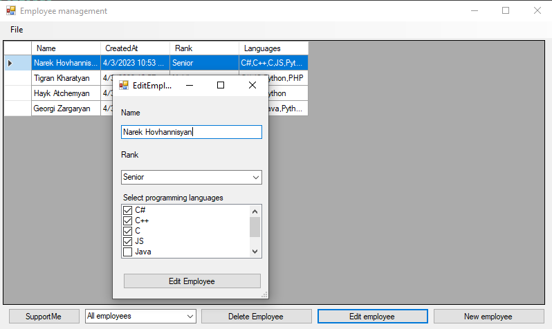

# Employee Management App Documentation
Welcome to the **Employee Management App**!

This app is designed to help you manage your employees easily and efficiently. The app uses a `.csv` file as its database to store all employee data. You can easily add new employees, update existing ones, and delete employees who are no longer with the company.

To get started, simply open the app and import your employee data from a `.csv` file. You can then view all employees in the app, as well as filter them by rank (junior, middle, senior). This allows you to easily view and manage employees based on their level of experience.

## Adding Employees

Adding new employees to the database is simple. Just click the "Add Employee" button and fill in the required information, such as their name, job title, and rank. Once you've added an employee, you can view their information in the app and make updates as needed.

## Updating Employees

Updating existing employees is just as easy. Simply select the employee you wish to update, make the necessary changes, and save your changes. You can also delete employees who are no longer with the company by selecting them and clicking the "Delete" button.

## Exporting Data

Finally, you can export all employee data to a `.csv` file, which makes it easy to share or backup your employee data.

## Conclusion

Overall, the Employee Management App is a powerful tool for any business looking to manage their employees effectively. With its intuitive interface and flexible features, it's the perfect solution for businesses of all sizes.

## Main interface

## Add new employee

## Update existing employee 

