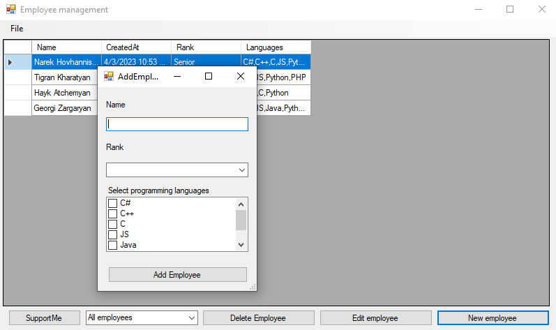
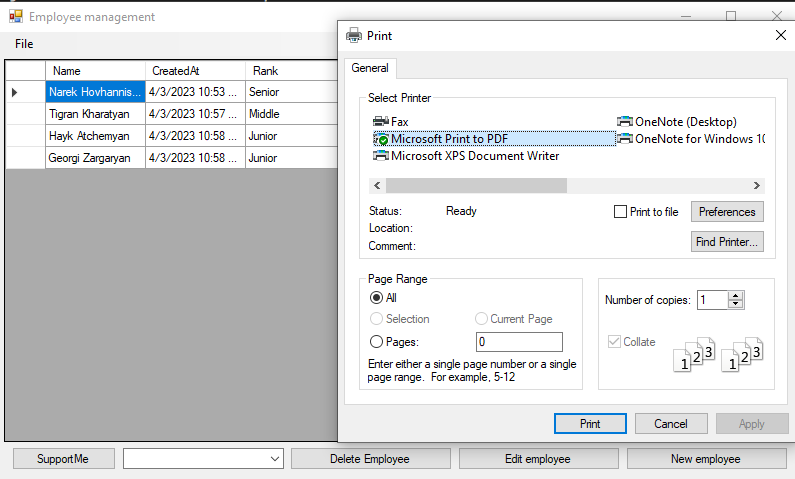
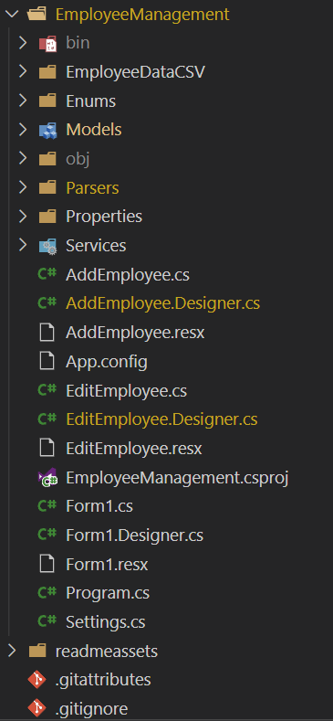
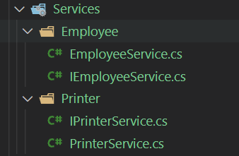
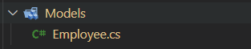

# Աշխատակիցների կառավարման հավելված

Այս հավելվածը նախատեսված է օգնելու ձեզ հեշտությամբ և արդյունավետ կառավարել ձեր աշխատակիցներին: Հավելվածն օգտագործում է `.csv` ֆայլը որպես տվյալների բազա՝ աշխատողների բոլոր տվյալները պահելու համար: Դուք կարող եք հեշտությամբ ավելացնել նոր աշխատակիցներ, թարմացնել առկաներին և ջնջել աշխատակիցներին, ովքեր այլևս ձեր կազմակերպության անդամ չեն:

Սկսելու համար պարզապես բացեք հավելվածը և ներմուծեք ձեր աշխատողի տվյալները `.csv` ֆայլից: Այնուհետև կարող եք դիտել հավելվածի բոլոր աշխատակիցներին, ինչպես նաև ֆիլտրել նրանց ըստ ռանկի 

- Junior
- Middle
- Senior

### Աշխատակիցների ավելացում

Նոր աշխատակից ավելացնելը պարզ է: Պարզապես սեղմեք **New employee** կոճակը և լրացրեք անհրաժեշտ տեղեկությունները, ինչպիսիք են 

- Անունը
- Կոչումը
- Ծրագրավորման լեզուների իմացություն

 Աշխատողին ավելացնելուց հետո կարող եք դիտել նրա տեղեկությունները հավելվածում և անհրաժեշտության դեպքում թարմացումներ կատարել:


### Տվյալների արտահանում (export)

Դուք կարող եք արտահանել աշխատողների բոլոր տվյալները `.csv` ֆայլ, ինչը հեշտացնում է ձեր աշխատակիցների տվյալների համօգտագործումը կամ կրկնօրինակումը:



#### Ահա հավելվածի կառուցվածքը`




Հավելվածի հիմնական տրամաբանությունը գտնվում է **Services** թղթապանակում



**Օրինակ,** եկեք ուսումնասիրենք աշխատակիցների թղթապանակը

`IEmployeeService.cs`
```cs
    public interface IEmployeeService
    {
        List<Employee> GetAll();
        Employee GetOne(string name, DateTime? CreatedAt = null);
        Employee GetOne(DateTime CreatedAt);
        List<Employee> FilterByRank(Rank rank);
        bool AddEmployee(Employee employee);
        bool UpdateEmployee(Employee employee);
        bool DeleteEmployee(Employee employee);
    }
```

`EmployeeService.cs`
```cs
internal class EmployeeService : IEmployeeService
{
    public List<Employee> GetAll()
    {
        List<Employee> list = new List<Employee>();
        IEnumerable<string> employees = File.ReadAllLines(Settings.EmployeeFilePath).Skip(1);
        foreach (string employee in employees)
            list.Add(CSVParser.Parse(employee));

        return list;
    }

    public Employee GetOne(string name, DateTime? CreatedAt = null)
    {
        List<Employee> employees = GetAll()
            .Where(e => e.Name == name)
            .ToList();
        if (CreatedAt != null)
            employees = employees.Where(e => e.CreatedAt == CreatedAt).ToList();

        return employees.FirstOrDefault();
    }

    .............
}
```

`EmployeeService.cs` ֆայլը ամբողջությամբ կարող եք տեսնել [այստեղ](https://github.com/NarekPVP/EmployeeManagement/blob/master/EmployeeManagement/Services/EmployeeService.cs):

Ինչպես տեսնում եք, `EmployeeService` դասը աշխատում է `Employee` դասի հետ, որը կոչվում է `մոդել`:Հավելվածների բոլոր մոդելները գտնվում են `Models` բաժնում։



```cs
public class Employee
{
    public string Name { get; set; }
    public DateTime CreatedAt { get; set; }
    public Rank Rank { get; set; }
    public string Languages { get; set; }
}
```

Այստեղ գրված են այն բոլոր հատկությունները, որոնք պետք է ունենա յուրաքանչյուր աշխատող *(Employee)*

Այստեղ կարող եք տեսնել Rank տիպ, որը ստանդարտ `enum` է:

Հավելվածի բոլոր `enum`-ները գտնվում են **Enums** բաժնում։


`Rank.cs`
```cs
public enum Rank
{
    Junior = 0, Middle = 1, Senior = 2
}
```

